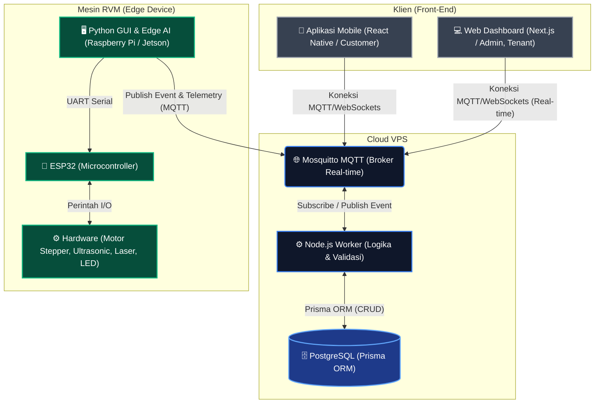
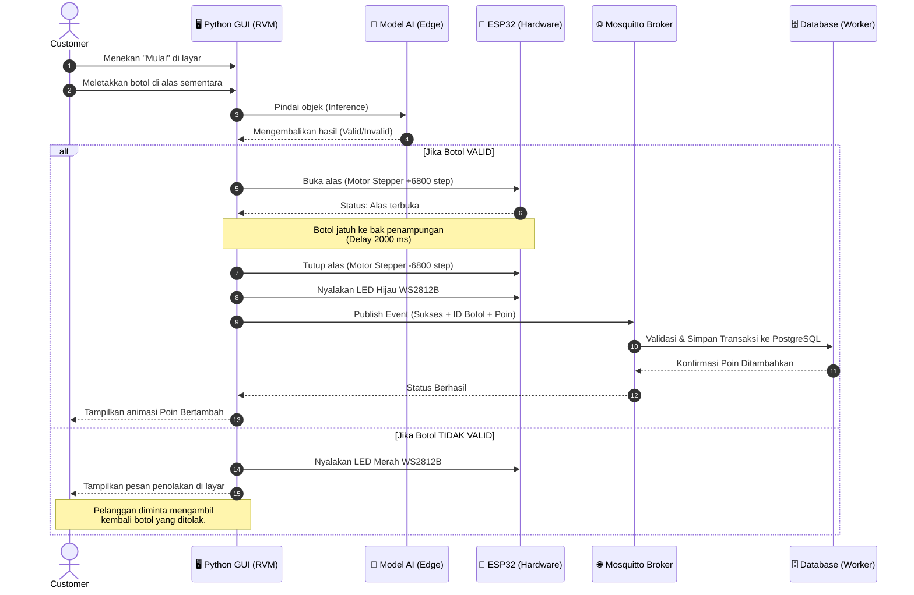
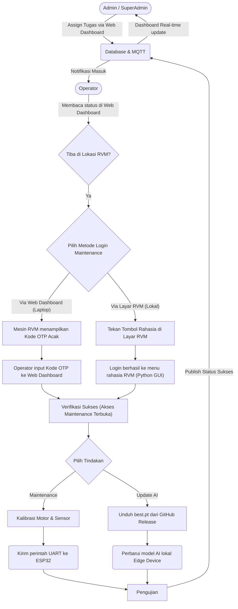

# Flowchart Sistem EARN (Eco Action & Reward Network)

Berdasarkan dokumen desain sistem (`SRS.md`, `SDD.md`, dan `SRD.md`) yang telah saya pelajari, EARN menggunakan **Arsitektur Event-Driven 100%** dengan protokol MQTT (tanpa HTTP REST API).

Berikut adalah visualisasi arsitektur dan alur sistemnya:

## 1. Arsitektur Jaringan (Global Topology)

Diagram ini menunjukkan bagaimana berbagai frontend, Edge Device di mesin fisik, dan Cloud VPS saling terhubung.

---

## 2. Alur Transaksi Penukaran Botol (Flowchart Interaksi)

Flowchart ini menjelaskan bagaimana sistem mengambil keputusan saat pelanggan (Customer) memasukkan botol ke dalam mesin Reverse Vending Machine (RVM).

---

## 3. Alur Penugasan & Kalibrasi (Operator Workflow)

Flowchart ini mencerminkan aktivitas manajerial dan pemeliharaan lapangan oleh Operator.

> [!TIP]
> **Arsitektur Tanpa REST API**: Karena keseluruhan sistem bergantung pada MQTT, komunikasi bersifat dua arah dan real-time. Hal ini membuat dashboard (seperti yang sudah kita buat pada Next.js) bisa memantau pergerakan mesin, status `Maintenance` atau `Penuh` tanpa perlu melakukan *refresh* atau *long-polling*.
